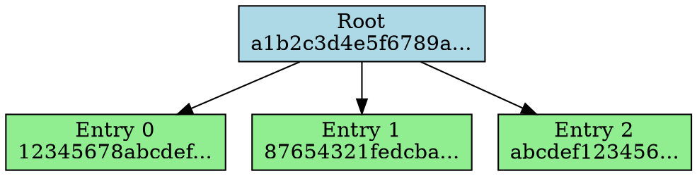

# Tree Visualization Examples

This document provides practical examples of using Sylva's visualization tools in different scenarios.

## Example 1: Basic Tree Visualization

### Creating a Sample Tree

```bash
# Initialize workspace
sylva init ./example_workspace
cd example_workspace

# Create some sample data
echo "Hello World" > hello.txt
echo "Goodbye World" > goodbye.txt
echo "Sample Data" > sample.txt

# Commit to create a tree
sylva commit hello.txt goodbye.txt sample.txt --message "Initial commit"
```

### ASCII Visualization

```bash
sylva visualize initial_commit
```

**Output:**
```
Tree Visualization (Binary)
═══════════════════════════════════════════════════════════════
🌳 Root
│   📋 a1b2c3d4e5f6789a...
├─ 🍃 Entry 0
│   📋 12345678abcdef...
│   ℹ️  version: 1
│   ℹ️  timestamp: 1634567890
│   ℹ️  data_size: 11
├─ 🍃 Entry 1
│   📋 87654321fedcba...
│   ℹ️  version: 2
│   ℹ️  timestamp: 1634567891
│   ℹ️  data_size: 13
└─ 🍃 Entry 2
    📋 abcdef123456...
    ℹ️  version: 3
    ℹ️  timestamp: 1634567892
    ℹ️  data_size: 11

Statistics:
  Total nodes: 4
  Total edges: 3
  Tree height: 1
  Leaf count: 3
```

### DOT Format Export

```bash
sylva visualize initial_commit --format dot --output tree.dot
```

**Generated DOT file:**


### Render with Graphviz

```bash
# Create PNG image
dot -Tpng tree.dot -o tree.png

# Create SVG for web use
dot -Tsvg tree.dot -o tree.svg

# Interactive viewer
dot -Tx11 tree.dot
```

## Example 2: Proof Path Tracing

### Generate a Proof

```bash
# First, get an entry ID from the tree
sylva info initial_commit

# Generate proof for specific entry
sylva prove initial_commit --entry-id 12345678-1234-1234-1234-123456789abc --output proof.json
```

### Trace the Proof Path

```bash
sylva trace initial_commit 12345678-1234-1234-1234-123456789abc
```

**Output:**
```
🔍 Proof Trace for Entry: 12345678-1234-1234-1234-123456789abc
════════════════════════════════════════════════════════════════

Tree Visualization (Binary)
🌳 Root
│   📋 a1b2c3d4e5f6789a...
├─ 🍃 Entry 0 [PROOF PATH]
│   📋 12345678abcdef...
├─ 🔍 Proof 0
│   📋 sibling_hash_1...
│   ℹ️  is_left: true
│   ℹ️  proof_step: 0
└─ 🔍 Proof 1
    📋 sibling_hash_2...
    ℹ️  is_left: false
    ℹ️  proof_step: 1

Proof Details:
  Entry ID: 12345678-1234-1234-1234-123456789abc
  Entry hash: 12345678abcdef...
  Root hash: a1b2c3d4e5f6789a...
  Proof path length: 2
  Step 1: sibling_hash_1... (left)
  Step 2: sibling_hash_2... (right)
```

### Export Proof Visualization

```bash
# DOT format for high-quality diagrams
sylva trace initial_commit 12345678-1234-1234-1234-123456789abc --format dot --output proof_trace.dot

# JSON for web tools
sylva trace initial_commit 12345678-1234-1234-1234-123456789abc --format json --output proof_trace.json
```

## Example 3: Debugging Tree Issues

### Create a Problematic Tree

```bash
# Create a tree with many entries to potentially cause imbalance
for i in {1..100}; do
    echo "Data entry $i" > entry_$i.txt
done

sylva commit entry_*.txt --message "Large commit"
```

### Debug Analysis

```bash
sylva debug large_commit
```

**Output:**
```
🔍 Tree Structure Analysis
════════════════════════════════════════════════════════════════
Tree type: Binary
Entry count: 100
Tree height: 7
Memory efficiency: 65.32%
Total memory: 51200 bytes
Is empty: false
Is valid: true
Balance factor: 0.45

Depth Analysis:
  Min depth: 0
  Max depth: 7
  Average depth: 3.50
  Depth variance: 2.14

⚠️  Warning: Tree appears to be unbalanced (factor: 0.45)
```

### Visualize the Problem

```bash
# Limited visualization to see structure issues
sylva visualize large_commit --max-depth 4 --max-nodes 20 --no-hashes
```

**Output:**
```
Tree Visualization (Binary)
═══════════════════════════════════════════════════════════════
🌳 Root
├─ 🍃 Entry 0
├─ 🍃 Entry 1
├─ 🍃 Entry 2
├─ 🍃 Entry 3
├─ 🍃 Entry 4
├─ 🍃 Entry 5
├─ 🍃 Entry 6
├─ 🍃 Entry 7
├─ 🍃 Entry 8
├─ 🍃 Entry 9
├─ 🍃 Entry 10
├─ 🍃 Entry 11
├─ 🍃 Entry 12
├─ 🍃 Entry 13
├─ 🍃 Entry 14
├─ 🍃 Entry 15
├─ 🍃 Entry 16
├─ 🍃 Entry 17
├─ 🍃 Entry 18
└─ 🍃 Entry 19

Statistics:
  Total nodes: 21
  Total edges: 20
  Tree height: 1
  Leaf count: 20
```

## Example 4: Tree Type Comparison

### Create Different Tree Types

```bash
# Binary tree
sylva commit file1.txt file2.txt --tree-type binary --message "Binary tree"

# Sparse tree  
sylva commit file1.txt file2.txt --tree-type sparse --message "Sparse tree"

# Patricia tree
sylva commit file1.txt file2.txt --tree-type patricia --message "Patricia tree"
```

### Compare Visualizations

```bash
# Binary tree visualization
echo "=== Binary Tree ==="
sylva visualize binary_tree --max-nodes 10

echo "=== Sparse Tree ==="
sylva visualize sparse_tree --max-nodes 10

echo "=== Patricia Tree ==="
sylva visualize patricia_tree --max-nodes 10
```

### Export All for Comparison

```bash
sylva visualize binary_tree --format dot --output binary.dot
sylva visualize sparse_tree --format dot --output sparse.dot
sylva visualize patricia_tree --format dot --output patricia.dot

# Render side by side
dot -Tpng binary.dot -o binary.png
dot -Tpng sparse.dot -o sparse.png  
dot -Tpng patricia.dot -o patricia.png
```

## Example 5: Web Integration with D3.js

### Export JSON Data

```bash
sylva visualize my_tree --format json --output tree_data.json
```

### HTML Visualization

```html
<!DOCTYPE html>
<html>
<head>
    <title>Sylva Tree Visualization</title>
    <script src="https://d3js.org/d3.v7.min.js"></script>
    <style>
        .node circle { fill: #69b3a2; stroke: #333; stroke-width: 2px; }
        .node.root circle { fill: #ff6b6b; }
        .node.leaf circle { fill: #4ecdc4; }
        .node.proof circle { fill: #ffe66d; stroke-width: 3px; }
        .link { stroke: #999; stroke-width: 2px; }
        .link.proof { stroke: #ff6b6b; stroke-width: 3px; }
        text { font-family: Arial, sans-serif; font-size: 12px; }
    </style>
</head>
<body>
    <div id="tree-container"></div>
    
    <script>
        // Load Sylva tree data
        d3.json("tree_data.json").then(function(treeData) {
            const width = 800;
            const height = 600;
            
            const svg = d3.select("#tree-container")
                .append("svg")
                .attr("width", width)
                .attr("height", height);
            
            // Convert nodes and edges to D3 format
            const nodes = Object.values(treeData.nodes);
            const links = treeData.edges.map(e => ({
                source: e.from,
                target: e.to,
                type: e.edge_type
            }));
            
            // Create force simulation
            const simulation = d3.forceSimulation(nodes)
                .force("link", d3.forceLink(links).id(d => d.id).distance(100))
                .force("charge", d3.forceManyBody().strength(-300))
                .force("center", d3.forceCenter(width / 2, height / 2));
            
            // Add links
            const link = svg.append("g")
                .selectAll("line")
                .data(links)
                .enter().append("line")
                .attr("class", d => `link ${d.type === "ProofPath" ? "proof" : ""}`);
            
            // Add nodes
            const node = svg.append("g")
                .selectAll("g")
                .data(nodes)
                .enter().append("g")
                .attr("class", d => `node ${d.node_type.toLowerCase()}`)
                .call(d3.drag()
                    .on("start", dragstarted)
                    .on("drag", dragged)
                    .on("end", dragended));
            
            node.append("circle")
                .attr("r", d => d.node_type === "Root" ? 20 : 15);
            
            node.append("text")
                .attr("dy", ".35em")
                .attr("text-anchor", "middle")
                .text(d => d.label);
            
            // Update positions on simulation tick
            simulation.on("tick", () => {
                link
                    .attr("x1", d => d.source.x)
                    .attr("y1", d => d.source.y)
                    .attr("x2", d => d.target.x)
                    .attr("y2", d => d.target.y);
                
                node
                    .attr("transform", d => `translate(${d.x},${d.y})`);
            });
            
            // Drag functions
            function dragstarted(event, d) {
                if (!event.active) simulation.alphaTarget(0.3).restart();
                d.fx = d.x;
                d.fy = d.y;
            }
            
            function dragged(event, d) {
                d.fx = event.x;
                d.fy = event.y;
            }
            
            function dragended(event, d) {
                if (!event.active) simulation.alphaTarget(0);
                d.fx = null;
                d.fy = null;
            }
        });
    </script>
</body>
</html>
```

## Example 6: Jupyter Notebook Integration

### Python Notebook Example

```python
import json
import subprocess
import networkx as nx
import matplotlib.pyplot as plt
from matplotlib.patches import FancyBboxPatch
import numpy as np

def visualize_sylva_tree(tree_name):
    """Visualize a Sylva tree in Jupyter notebook"""
    
    # Get tree data from Sylva
    result = subprocess.run([
        'sylva', 'visualize', tree_name, '--format', 'json'
    ], capture_output=True, text=True)
    
    if result.returncode != 0:
        print(f"Error: {result.stderr}")
        return
    
    tree_data = json.loads(result.stdout)
    
    # Create NetworkX graph
    G = nx.DiGraph()
    
    # Add nodes with attributes
    for node_id, node in tree_data['nodes'].items():
        G.add_node(node_id, **node)
    
    # Add edges
    for edge in tree_data['edges']:
        G.add_edge(edge['from'], edge['to'], **edge)
    
    # Create layout
    if tree_data['tree_type'] == 'Binary':
        # Use hierarchical layout for binary trees
        pos = nx.nx_agraph.graphviz_layout(G, prog='dot')
    else:
        pos = nx.spring_layout(G, k=1, iterations=50)
    
    # Set up the plot
    plt.figure(figsize=(12, 8))
    ax = plt.gca()
    
    # Draw edges
    nx.draw_networkx_edges(G, pos, edge_color='gray', arrows=True, 
                          arrowsize=20, alpha=0.7)
    
    # Draw nodes with different colors based on type
    node_colors = {
        'Root': 'lightblue',
        'Internal': 'lightgray', 
        'Leaf': 'lightgreen',
        'ProofNode': 'yellow',
        'SiblingNode': 'orange'
    }
    
    for node_type, color in node_colors.items():
        node_list = [n for n, d in G.nodes(data=True) 
                    if d.get('node_type') == node_type]
        if node_list:
            nx.draw_networkx_nodes(G, pos, nodelist=node_list, 
                                 node_color=color, node_size=800)
    
    # Draw labels
    labels = {n: d['label'] for n, d in G.nodes(data=True)}
    nx.draw_networkx_labels(G, pos, labels, font_size=10)
    
    # Add title and stats
    stats = tree_data['statistics']
    plt.title(f"Sylva Tree: {tree_name} ({tree_data['tree_type']})\n"
             f"Nodes: {stats['total_nodes']}, "
             f"Height: {stats['tree_height']}, "
             f"Leaves: {stats['leaf_count']}")
    
    plt.axis('off')
    plt.tight_layout()
    plt.show()
    
    return tree_data

# Usage
tree_data = visualize_sylva_tree('my_tree')
```

## Example 7: Performance Monitoring

### Create Monitoring Script

```bash
#!/bin/bash
# monitor_trees.sh - Monitor tree health over time

TREES=("tree1" "tree2" "tree3")
OUTPUT_DIR="tree_monitoring"
TIMESTAMP=$(date +%Y%m%d_%H%M%S)

mkdir -p "$OUTPUT_DIR/$TIMESTAMP"

for tree in "${TREES[@]}"; do
    echo "Analyzing $tree..."
    
    # Debug analysis
    sylva debug "$tree" > "$OUTPUT_DIR/$TIMESTAMP/${tree}_debug.txt"
    
    # Visual representation
    sylva visualize "$tree" --format json --output "$OUTPUT_DIR/$TIMESTAMP/${tree}_structure.json"
    
    # DOT for archival
    sylva visualize "$tree" --format dot --output "$OUTPUT_DIR/$TIMESTAMP/${tree}_structure.dot"
    
    echo "Analysis complete for $tree"
done

echo "Monitoring data saved to $OUTPUT_DIR/$TIMESTAMP"
```

### Create Health Dashboard

```python
import os
import json
import matplotlib.pyplot as plt
from datetime import datetime

def create_health_dashboard(monitoring_dir):
    """Create a health dashboard from monitoring data"""
    
    timestamps = sorted(os.listdir(monitoring_dir))
    
    health_data = {}
    
    for timestamp in timestamps:
        timestamp_dir = os.path.join(monitoring_dir, timestamp)
        if not os.path.isdir(timestamp_dir):
            continue
            
        dt = datetime.strptime(timestamp, '%Y%m%d_%H%M%S')
        
        for file in os.listdir(timestamp_dir):
            if file.endswith('_structure.json'):
                tree_name = file.replace('_structure.json', '')
                
                with open(os.path.join(timestamp_dir, file)) as f:
                    tree_data = json.load(f)
                
                if tree_name not in health_data:
                    health_data[tree_name] = {
                        'timestamps': [],
                        'node_counts': [],
                        'heights': [],
                        'leaf_counts': []
                    }
                
                stats = tree_data['statistics']
                health_data[tree_name]['timestamps'].append(dt)
                health_data[tree_name]['node_counts'].append(stats['total_nodes'])
                health_data[tree_name]['heights'].append(stats['tree_height'])
                health_data[tree_name]['leaf_counts'].append(stats['leaf_count'])
    
    # Create dashboard plots
    fig, axes = plt.subplots(2, 2, figsize=(15, 10))
    fig.suptitle('Tree Health Dashboard', fontsize=16)
    
    for tree_name, data in health_data.items():
        axes[0, 0].plot(data['timestamps'], data['node_counts'], 
                       label=tree_name, marker='o')
        axes[0, 1].plot(data['timestamps'], data['heights'], 
                       label=tree_name, marker='s')
        axes[1, 0].plot(data['timestamps'], data['leaf_counts'], 
                       label=tree_name, marker='^')
    
    axes[0, 0].set_title('Total Nodes Over Time')
    axes[0, 0].set_ylabel('Node Count')
    axes[0, 0].legend()
    axes[0, 0].grid(True)
    
    axes[0, 1].set_title('Tree Height Over Time')
    axes[0, 1].set_ylabel('Height')
    axes[0, 1].legend()
    axes[0, 1].grid(True)
    
    axes[1, 0].set_title('Leaf Count Over Time')
    axes[1, 0].set_ylabel('Leaf Count')
    axes[1, 0].legend()
    axes[1, 0].grid(True)
    
    # Tree health score calculation
    axes[1, 1].set_title('Tree Health Scores')
    for tree_name, data in health_data.items():
        if data['node_counts']:
            latest_nodes = data['node_counts'][-1]
            latest_height = data['heights'][-1]
            latest_leaves = data['leaf_counts'][-1]
            
            # Simple health score based on balance
            optimal_height = np.log2(latest_leaves) if latest_leaves > 0 else 1
            health_score = optimal_height / max(latest_height, 1) * 100
            
            axes[1, 1].bar(tree_name, health_score)
    
    axes[1, 1].set_ylabel('Health Score (%)')
    axes[1, 1].set_ylim(0, 100)
    
    plt.tight_layout()
    plt.show()

# Usage
create_health_dashboard('tree_monitoring')
```

These examples demonstrate the practical applications of Sylva's visualization tools across different scenarios, from basic tree inspection to advanced monitoring and web integration.